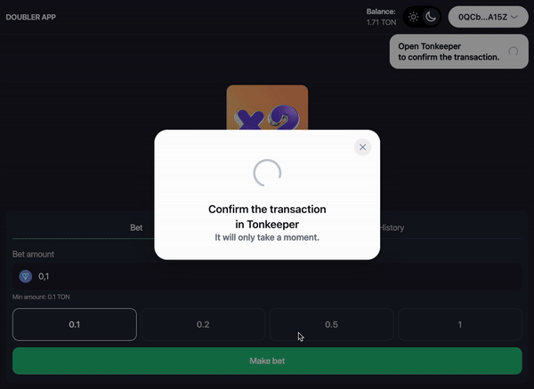

# Bet Doubler on TON

**Bet Doubler** is an application for interacting with a smart contract on the TON blockchain that offers you the chance to double your bet. You send a transaction with your bet to the smart contract, and the contract automatically determines the outcome: your bet is either doubled or lost.

## Preview



## Stacks

- React
- TypeScript
- Tailwind
- FunC - for smart-contract

## How It Works:

1.	A user sends a bet to the smart contract.
2.	The smart contract uses a pseudo-random algorithm to determine the result (win or lose).
3.	If you win, the smart contract sends back an amount twice the size of your initial bet. If you lose, the funds are not returned.

### Setup

#### Add .env file to root directory

```
VITE_CONTRACT_ADDRESS=
```

#### Install deps

```
npm install or yarn install
```

#### Run client

```
npm run dev
```